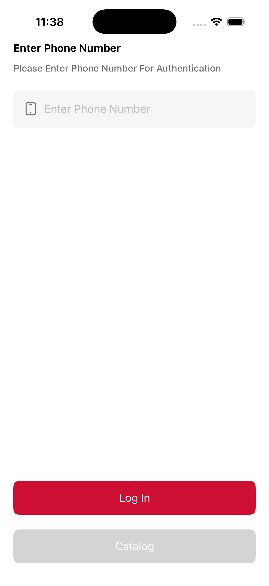
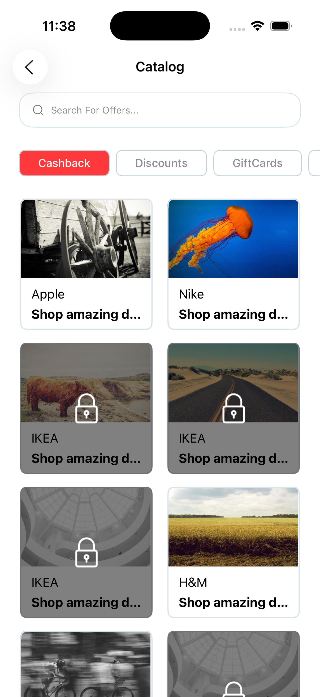

# Dsquares-Task

> ### ⚠️ IMPORTANT — API WARNING
>
> **THE API DOCUMENTATION DID NOT INCLUDE A BASE URL.**
> As a result, the network endpoints in this project were not testable against the real API. All API calls are therefore unverified and will not work until a correct base URL (and any required credentials) are provided. Only the "Get Items" flow was exercised against a local/mock repository for development and tests — no other endpoints were verified.
>
> Treat this repository as a partially-mocked prototype until the API base URL and authentication details are supplied.

## Project Overview

`Dsquares-Task` is an iOS application and library demonstrating a small catalog feature: fetching items, viewing details, and a purchase flow. The project is organized to separate domain logic, networking, data mappers, and presentation (SwiftUI). The code lives under the `Library/CatalogFeature` package and the iOS app target sits at the repo root.

## Architecture

- Clean/modular structure with a feature package at `Library/CatalogFeature`.
- Layers:
	- `Domain` — Entities, Repo protocols, and Use Cases.
	- `Repositories` — Data access implementations (network/data sources).
	- `Remote` — DTOs and request/endpoint definitions.
	- `Presentation` — SwiftUI views and `CatalogViewModel`.
	- `Network` — Core networking primitives and configuration.

Key files and locations:

- App entry: `Dsquares-task/Dsquares_taskApp.swift`
- Feature package: `Library/CatalogFeature/Sources/CatalogFeature/`
	- Domain Entities: `Domain/Entities/`
	- Repositories: `Repositories/DsquaresRepo.swift`
	- Use Cases: `Domain/UseCases/` (e.g., `GetItemsUseCase.swift`)
	- Presentation: `Presentation/ViewModel/CatalogViewModel.swift`, `Presentation/CatalogView.swift`
- Tests and mocks: `Library/CatalogFeature/Tests/CatalogFeatureTests/`
	- Mock repository: `Library/CatalogFeature/Tests/CatalogFeatureTests/Mocks/MockDsquaresRepository.swift`

## Features

- Browse catalog items (mocked GET items)
- View item details
- Purchase flow (in code, requires working API)
- Modular package structure suitable for reuse

## Tech Stack

- Language: Swift
- UI: SwiftUI
- Packaging: Swift Package Manager (`Package.swift` in `Library/CatalogFeature`)
- Tests: Xcode unit tests under `Dsquares-taskTests` and `Library/CatalogFeature/Tests`

## Getting Started

Prerequisites:

- macOS with Xcode installed (version compatible with SwiftUI and the package settings)

To open the project in Xcode:

1. Open the workspace in Xcode: `open Dsquares-task.xcodeworkspace`
2. Select the appropriate scheme (app or tests) and run on a simulator or device.

Note: The app relies on a backend API that is missing a documented base URL. Without that, the network-backed repository implementations will fail. Use the mock repository for local development.

## Running with the Mock (development)

The unit tests and the mock repository are useful while the real API is unavailable.

1. Open the test target `CatalogFeatureTests` in Xcode, or run tests via Xcode's Test action.
2. The mock implementation is at `Library/CatalogFeature/Tests/CatalogFeatureTests/Mocks/MockDsquaresRepository.swift`. This mock is used by the feature tests to exercise `GetItemsUseCase` and other flows without a network.

If you want to run the app using the mock in-app, swap the repository implementation used by the `CatalogViewModel` or dependency injection entrypoint to use `MockDsquaresRepository`.

## API Notes

- The original API docs provided for this task did not include a base URL. Because of that:
	- Network endpoints in `Library/CatalogFeature/Sources/CatalogFeature/Remote/` are present but untested.
	- Authentication details (if any) are unknown and not configured.
	- Only a mocked `Get Items` flow was validated via the test mocks.

To fully enable real API calls you must:

1. Provide the API base URL and any auth (API key / token) to `Library/CatalogFeature/Sources/CatalogFeature/Network/Configuration/SDKConfiguration.swift` or the appropriate configuration location.
2. Run integration tests or manual verification against the real API.

## Tests

- Unit tests: `Dsquares-taskTests/` and `Library/CatalogFeature/Tests/CatalogFeatureTests/`.
- Mocks: `Library/CatalogFeature/Tests/CatalogFeatureTests/Mocks/`

Run tests in Xcode or via `xcodebuild` for CI.

## Contributing

If you'd like to contribute:

1. Open an issue describing the change or bug.
2. Send a PR with focused changes and tests where applicable.

## Known Limitations

- Missing API base URL and credentials — see the warning at the top. This is the critical blocker for integration testing.
- Some flows (purchase, token generation, etc.) are implemented in code but cannot be verified without the real backend.

## License

See the repository `LICENSE` file for license terms.

---

If you want, I can also:

- Add a short example showing how to swap in `MockDsquaresRepository` at runtime.
- Add a `CONTRIBUTING.md` or a small script to run tests from the command line.

## Screenshots

  
  

